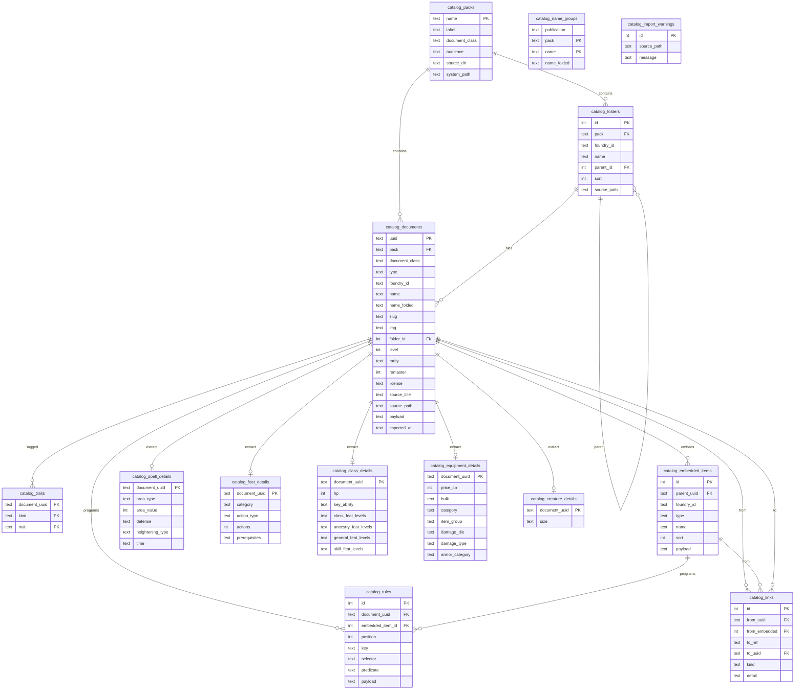

# Catalog ERD

Tables created by `20261012172400-create-catalog`. `play_*` is omitted; those rows are character state and are not part of this migration.

```mermaid
erDiagram
    catalog_packs ||--o{ catalog_folders : contains
    catalog_packs ||--o{ catalog_documents : contains
    catalog_folders ||--o{ catalog_folders : parent
    catalog_folders ||--o{ catalog_documents : files

    catalog_documents ||--o{ catalog_traits : tagged
    catalog_documents ||--o{ catalog_embedded_items : embeds
    catalog_documents ||--o{ catalog_rules : programs
    catalog_embedded_items ||--o{ catalog_rules : programs
    catalog_documents ||--o{ catalog_links : "from"
    catalog_embedded_items ||--o{ catalog_links : "from"
    catalog_documents ||--o{ catalog_links : "to"

    catalog_documents ||--o| catalog_spell_details : extract
    catalog_documents ||--o| catalog_feat_details : extract
    catalog_documents ||--o| catalog_class_details : extract
    catalog_documents ||--o| catalog_equipment_details : extract
    catalog_documents ||--o| catalog_creature_details : extract

    catalog_packs {
        text name PK
        text label
        text document_class
        text audience
        text source_dir
        text system_path
    }

    catalog_folders {
        int id PK
        text pack FK
        text foundry_id
        text name
        int parent_id FK
        int sort
        text source_path
    }

    catalog_documents {
        text uuid PK
        text pack FK
        text document_class
        text type
        text foundry_id
        text name
        text name_folded
        text slug
        text img
        int folder_id FK
        int level
        text rarity
        int remaster
        text license
        text source_title
        text source_path
        text payload
        text imported_at
    }

    catalog_traits {
        text document_uuid PK
        text kind PK
        text trait PK
    }

    catalog_embedded_items {
        int id PK
        text parent_uuid FK
        text foundry_id
        text type
        text name
        int sort
        text payload
    }

    catalog_rules {
        int id PK
        text document_uuid FK
        int embedded_item_id FK
        int position
        text key
        text selector
        text predicate
        text payload
    }

    catalog_links {
        int id PK
        text from_uuid FK
        int from_embedded FK
        text to_ref
        text to_uuid FK
        text kind
        text detail
    }

    catalog_name_groups {
        text publication
        text pack PK
        text name PK
        text name_folded
    }

    catalog_spell_details {
        text document_uuid PK
        text area_type
        int area_value
        text defense
        text heightening_type
        text time
    }

    catalog_feat_details {
        text document_uuid PK
        text category
        text action_type
        int actions
        text prerequisites
    }

    catalog_class_details {
        text document_uuid PK
        int hp
        text key_ability
        text class_feat_levels
        text ancestry_feat_levels
        text general_feat_levels
        text skill_feat_levels
    }

    catalog_equipment_details {
        text document_uuid PK
        int price_cp
        text bulk
        text category
        text item_group
        text damage_die
        text damage_type
        text armor_category
    }

    catalog_creature_details {
        text document_uuid PK
        text size
    }

    catalog_import_warnings {
        int id PK
        text source_path
        text message
    }
```
